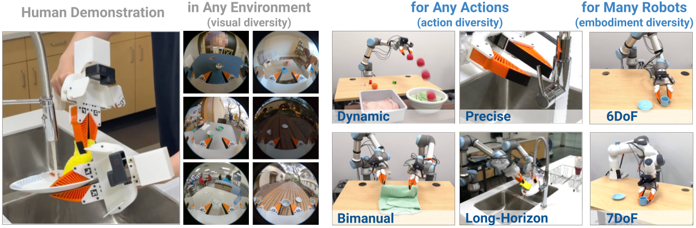
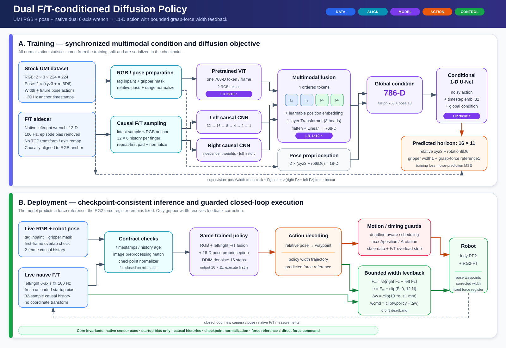
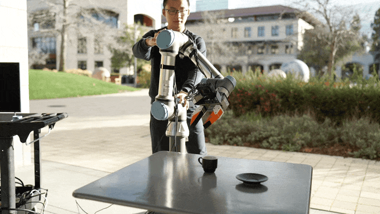
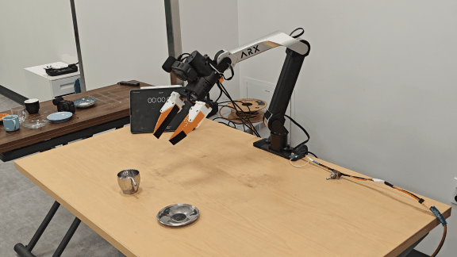

# Universal Manipulation Interface

[[Project page]](https://umi-gripper.github.io/)
[[Paper]](https://umi-gripper.github.io/#paper)
[[Hardware Guide]](https://docs.google.com/document/d/1TPYwV9sNVPAi0ZlAupDMkXZ4CA1hsZx7YDMSmcEy6EU/edit?usp=sharing)
[[Data Collection Instruction]](https://swanky-sphere-ad1.notion.site/UMI-Data-Collection-Tutorial-4db1a1f0f2aa4a2e84d9742720428b4c?pvs=4)
[[SLAM repo]](https://github.com/cheng-chi/ORB_SLAM3)
[[SLAM docker]](https://hub.docker.com/r/chicheng/orb_slam3)



[Cheng Chi](http://cheng-chi.github.io/)<sup>1,2</sup>,
[Zhenjia Xu](https://www.zhenjiaxu.com/)<sup>1,2</sup>,
[Chuer Pan](https://chuerpan.com/)<sup>1</sup>,
[Eric Cousineau](https://www.eacousineau.com/)<sup>3</sup>,
[Benjamin Burchfiel](http://www.benburchfiel.com/)<sup>3</sup>,
[Siyuan Feng](https://www.cs.cmu.edu/~sfeng/)<sup>3</sup>,

[Russ Tedrake](https://groups.csail.mit.edu/locomotion/russt.html)<sup>3</sup>,
[Shuran Song](https://www.cs.columbia.edu/~shurans/)<sup>1,2</sup>

<sup>1</sup>Stanford University,
<sup>2</sup>Columbia University,
<sup>3</sup>Toyota Research Institute

## 🛠️ Installation
Only tested on Ubuntu 22.04

Install docker following the [official documentation](https://docs.docker.com/engine/install/ubuntu/) and finish [linux-postinstall](https://docs.docker.com/engine/install/linux-postinstall/).

Install system-level dependencies:
```console
$ sudo apt install -y libosmesa6-dev libgl1-mesa-glx libglfw3 patchelf
```

We recommend [Miniforge](https://github.com/conda-forge/miniforge?tab=readme-ov-file#miniforge3) instead of the standard anaconda distribution for faster installation: 
```console
$ mamba env create -f conda_environment.yaml
```

Activate environment
```console
$ conda activate umi
(umi)$ 
```

## Running UMI SLAM pipeline
Download example data
```console
(umi)$ wget --recursive --no-parent --no-host-directories --cut-dirs=2 --relative --reject="index.html*" https://real.stanford.edu/umi/data/example_demo_session/
```

Run SLAM pipeline
```console
(umi)$ python run_slam_pipeline.py example_demo_session

...
Found following cameras:
camera_serial
C3441328164125    5
Name: count, dtype: int64
Assigned camera_idx: right=0; left=1; non_gripper=2,3...
             camera_serial  gripper_hw_idx                                     example_vid
camera_idx                                                                                
0           C3441328164125               0  demo_C3441328164125_2024.01.10_10.57.34.882133
99% of raw data are used.
defaultdict(<function main.<locals>.<lambda> at 0x7f471feb2310>, {})
n_dropped_demos 0
````
For this dataset, 99% of the data are useable (successful SLAM), with 0 demonstrations dropped. If your dataset has a low SLAM success rate, double check if you carefully followed our [data collection instruction](https://swanky-sphere-ad1.notion.site/UMI-Data-Collection-Instruction-4db1a1f0f2aa4a2e84d9742720428b4c). 

Despite our significant effort on robustness improvement, OBR_SLAM3 is still the most fragile part of UMI pipeline. If you are an expert in SLAM, please consider contributing to our fork of [OBR_SLAM3](https://github.com/cheng-chi/ORB_SLAM3) which is specifically optimized for UMI workflow.

Generate dataset for training.
```console
(umi)$ python scripts_slam_pipeline/07_generate_replay_buffer.py -o example_demo_session/dataset.zarr.zip example_demo_session
```

## Training Diffusion Policy
Single-GPU training. Tested to work on RTX3090 24GB.
```console
(umi)$ python train.py --config-name=train_diffusion_unet_timm_umi_workspace task.dataset_path=example_demo_session/dataset.zarr.zip
```

Multi-GPU training.
```console
(umi)$ accelerate --num_processes <ngpus> train.py --config-name=train_diffusion_unet_timm_umi_workspace task.dataset_path=example_demo_session/dataset.zarr.zip
```

Downloading in-the-wild cup arrangement dataset (processed).
```console
(umi)$ wget https://real.stanford.edu/umi/data/zarr_datasets/cup_in_the_wild.zarr.zip
```

Multi-GPU training.
```console
(umi)$ accelerate --num_processes <ngpus> train.py --config-name=train_diffusion_unet_timm_umi_workspace task.dataset_path=cup_in_the_wild.zarr.zip
```

## Indy RP2 + RG2-FT: 260827 Train and Evaluation Commands

Run the following commands from the repository root in the `umi` environment.
The effective training data is deliberately split into two inputs:



The upper panel shows training-time synchronization and model structure. The
lower panel shows checkpoint-consistent real-robot inference, bounded
force-to-width feedback, and the final safety gates.

- `session_260827/dataset.zarr.zip`: stock UMI RGB, robot pose, and gripper width;
- `session_260827/dataset_force_sidecar.zarr`: synchronized native left/right
  F/T data with per-episode bias removed.

Do not replace the stock ZIP with `dataset_multirate.zarr` or use
`wrench_force_tcp_6d`. The policy consumes native sensor-frame
`wrench_12d = [left 6-D, right 6-D]` without a TCP/axis coordinate transform.

### Fresh 4-GPU training

This uses batch 8 per GPU, so the global batch is `4 × 8 = 32`. `run2` below
must be a new output directory; do not point a fresh run at an existing run.

```bash
accelerate launch \
  --multi_gpu \
  --num_processes 4 \
  --gpu_ids 0,1,2,3 \
  --mixed_precision no \
  --main_process_port 29511 \
  train.py \
  --config-name=train_diffusion_unet_timm_umi_dual_ft_workspace \
  task.dataset_path=session_260827/dataset.zarr.zip \
  task.force_sidecar_path=session_260827/dataset_force_sidecar.zarr \
  dataloader.batch_size=8 \
  val_dataloader.batch_size=8 \
  dataloader.num_workers=4 \
  val_dataloader.num_workers=2 \
  training.resume=false \
  hydra.run.dir=data/outputs/260827_dual_ft_4gpu_b32_run2
```

Expected startup line:

```text
training distribution: processes=4 per_device_batch=8 gradient_accumulation=1 global_batch=32 mixed_precision=no
```

Only the pretrained ViT uses LR `3e-5`; the fusion Transformer uses `1e-4`,
and the F/T CNN/projection plus the diffusion model use the base LR `3e-4`.

### Resume the interrupted `run1`

Resume must use the exact same `hydra.run.dir`. It loads
`<run-dir>/checkpoints/latest.ckpt` and continues from the next epoch. Do not
change batch size, process count, data paths, or model configuration while
resuming.

```bash
accelerate launch \
  --multi_gpu \
  --num_processes 4 \
  --gpu_ids 0,1,2,3 \
  --mixed_precision no \
  --main_process_port 29511 \
  train.py \
  --config-name=train_diffusion_unet_timm_umi_dual_ft_workspace \
  task.dataset_path=session_260827/dataset.zarr.zip \
  task.force_sidecar_path=session_260827/dataset_force_sidecar.zarr \
  dataloader.batch_size=8 \
  val_dataloader.batch_size=8 \
  dataloader.num_workers=4 \
  val_dataloader.num_workers=2 \
  training.resume=true \
  hydra.run.dir=data/outputs/260827_dual_ft_4gpu_b32_run1
```

Confirm that the log prints both `Resuming from checkpoint .../latest.ckpt`
and `Resume state: completed_epoch=... next_epoch=...`.

Check free space before restarting:

```bash
df -h .
du -sh data/outputs/260827_dual_ft_4gpu_b32_run1/checkpoints
```

One checkpoint is currently about 2.7 GB. With `topk.k=20` plus
`latest.ckpt`, checkpoint retention alone can require roughly 56 GB.

### Checkpoint inspection and offline evaluation

Metadata inspection does not connect to the robot, camera, or RG2-FT:

```bash
conda run -n umi python eval_real_indy_rg2_dual_ft.py \
  --checkpoint data/outputs/260827_dual_ft_4gpu_b32_run1/checkpoints/latest.ckpt \
  --inspect-checkpoint
```

Quick hardware-free validation on 256 samples:

```bash
mkdir -p data/eval_dual_ft

conda run -n umi python eval_dual_ft_offline.py \
  --checkpoint data/outputs/260827_dual_ft_4gpu_b32_run1/checkpoints/latest.ckpt \
  --dataset session_260827/dataset.zarr.zip \
  --force-sidecar session_260827/dataset_force_sidecar.zarr \
  --weights auto \
  --device cuda \
  --batch-size 8 \
  --max-samples 256 \
  --seed 42 \
  --output data/eval_dual_ft/offline_metrics.json
```

`--weights auto` selects EMA when `training.use_ema=true`. Use
`--max-samples 0 --full-dataset-hash` for the complete validation split.

### Real-robot dry-run first

The dry-run below opens the robot, camera, and RG2-FT connections, performs a
fresh unloaded startup F/T bias calibration, restores the model, and runs all
preprocessing/timing/safety checks. It suppresses waypoint submission from the
evaluation loop, but it is not a passive or protocol-free mode.

```bash
conda run -n umi python eval_real_indy_rg2_dual_ft.py \
  --checkpoint data/outputs/260827_dual_ft_4gpu_b32_run1/checkpoints/latest.ckpt \
  --robot-config example/eval_robots_config_indy_rg2.yaml \
  --log-dir data/eval_dual_ft/dry_run1 \
  --match-dataset session_260827/dataset.zarr.zip \
  --n-action-steps 1 \
  --dry-run \
  --max-cycles 1 \
  --reference-arg=--print_motion_debug
```

Before pressing `c`, verify the unloaded startup-bias record and align the
live 224×224 policy image with the selected training first frame. The image
contract matches the initial image-only commit: tag inpainting, gripper mask,
no finger mask, resize ratio 1.0, and no distortion correction.

### Low-speed live one-cycle commissioning

Only after the dry-run output is correct, remove `--dry-run` while keeping one
action step and one policy cycle:

```bash
conda run -n umi python eval_real_indy_rg2_dual_ft.py \
  --checkpoint data/outputs/260827_dual_ft_4gpu_b32_run1/checkpoints/latest.ckpt \
  --robot-config example/eval_robots_config_indy_rg2.yaml \
  --log-dir data/eval_dual_ft/live_one_cycle1 \
  --match-dataset session_260827/dataset.zarr.zip \
  --n-action-steps 1 \
  --max-cycles 1 \
  --reference-arg=--print_motion_debug
```

Keep the physical emergency stop ready. Teleop remains in control until `c`
is pressed. Use `t` to save the current start pose, `p` to request a guarded
move to that saved pose, `n`/`b` to change the training first-frame reference,
`s` to stop policy execution, and `Esc` to exit.

The 11th action channel is a grasp-force reference used only to apply a bounded
correction to gripper width. It is never sent as a direct RG2 force command;
the hardware force register remains fixed by `rg2ft_force` in the robot YAML.

### Continuous live evaluation

After the one-cycle motion and F/T guards have been verified on the physical
setup, run closed-loop evaluation without `--max-cycles`. Two action steps at
20 Hz give a 100 ms replanning interval:

```bash
conda run -n umi python eval_real_indy_rg2_dual_ft.py \
  --checkpoint data/outputs/260827_dual_ft_4gpu_b32_run1/checkpoints/latest.ckpt \
  --robot-config example/eval_robots_config_indy_rg2.yaml \
  --log-dir data/eval_dual_ft/live_run1 \
  --match-dataset session_260827/dataset.zarr.zip \
  --n-action-steps 2
```

See [the evaluation guide](docs/run_dual_ft_inference.md) and
[the implementation/safety audit](docs/dual_ft_inference_audit.md) for the
complete contracts and remaining commissioning limits.

<details>
<summary><strong>2026-09-04 — RG2-FT Dual F/T v3: verified Indy real-robot deployment</strong></summary>

This is the current, verified deployment recipe for the Indy + RG2-FT
dual-force/torque policy. It uses the deployment contract
`dual_ft_786_action11_xyzw_v3`; do not substitute an older image-only or
18-D-proprioception checkpoint.

| Item | Verified value |
| --- | --- |
| Checkpoint | `data/latest_rg_ft.ckpt` |
| Match dataset / episode | `data/dataset_ft.zarr.zip`, episode `0` |
| Prediction horizon | 16 actions (serialized in the checkpoint) |
| Executed before replanning | 4 actions (`--steps_per_inference 4`) |
| Action scale | `1.0` (TCP translation and rotation; not gripper width) |
| Iteration limit | Unlimited unless `--max_policy_iters` is supplied |
| Output logs | `data/eval_indy_rg2/eval_logs/ep*_YYYYMMDD_HHMMSS/` |

The 4-action setting has a nominal 200 ms replanning interval at the policy's
19.98 Hz action frequency. The checkpoint still predicts 16 actions; this
option only changes how many predicted rows are sent before the next policy
call.

Enter the already-running deployment container from the host:

```bash
docker exec -it indy_umi_ft bash
```

Then, inside the container, start with a non-motion validation run. It
connects and records live observations but does not submit robot/gripper
waypoints:

```bash
cd /ros2_ws/src/indy_umi_rg_ft

RG2_ENABLE_MOTION=0 \
RG2_CHECKPOINT=/ros2_ws/src/indy_umi_rg_ft/data/latest_rg_ft.ckpt \
MATCH_DATASET=/ros2_ws/src/indy_umi_rg_ft/data/dataset_ft.zarr.zip \
MATCH_EPISODE=0 \
ACTION_SCALE=1.0 \
./deploy_real_indy_rg2.sh --steps_per_inference 4
```

After confirming the live policy image, pose, F/T zeroing, and emergency-stop
condition, enable actual motion with the same checkpoint and dataset:

```bash
cd /ros2_ws/src/indy_umi_rg_ft

RG2_ENABLE_MOTION=1 \
RG2_CHECKPOINT=/ros2_ws/src/indy_umi_rg_ft/data/latest_rg_ft.ckpt \
MATCH_DATASET=/ros2_ws/src/indy_umi_rg_ft/data/dataset_ft.zarr.zip \
MATCH_EPISODE=0 \
ACTION_SCALE=1.0 \
./deploy_real_indy_rg2.sh --steps_per_inference 4
```

Use `--steps_per_inference 1` for the most conservative per-action debugging;
the accepted values are `1`, `2`, `4`, `6`, and `8`. To impose a finite test
run, append `--max_policy_iters N`. The current motion guard limits each
consecutive waypoint to 15 mm translation, 0.1 rad rotation, and 15 mm gripper
width change. Evaluation logs include the comparison video, full 16-step model
outputs, scheduled commands, F/T histories, and fusion-attention diagnostics.

</details>

## Valve-state context classifier

<details>
<summary><strong>v4 (current) — causal 5-phase / 4-error classifier</strong></summary>

The v4 bundle estimates the current valve-manipulation phase and error reason
from RGB, TCP state, gripper width, and native dual F/T histories. The
classifier is a frozen context estimator; the policy-side context encoder and
stage-conditioned adapters/MoE are the trainable components.

Local paths on `metafarmers-server2`:

```text
Bundle:     /home/metafarmers/dkim/umi_ft/valve_state_classifier_v4
Checkpoint: /home/metafarmers/dkim/umi_ft/valve_state_classifier_v4/model/final.pt
```

The repository-relative checkpoint path is:

```text
valve_state_classifier_v4/model/final.pt
```

Verify the exported checkpoint before integration:

```bash
cd /home/metafarmers/dkim/umi_ft/valve_state_classifier_v4
python verify_install.py --device cuda
```

Minimal streaming use from the repository root:

```python
from pathlib import Path
import sys

import numpy as np

bundle_dir = Path("valve_state_classifier_v4").resolve()
sys.path.insert(0, str(bundle_dir))

from valve_state_classifier import (  # noqa: E402
    ERROR_REASON_NAMES,
    PHASE_NAMES,
    ValveStateRuntime,
)

runtime = ValveStateRuntime(bundle_dir / "model/final.pt", device="cuda")

# Enqueue every raw 100 Hz dual-wrench sample no newer than the RGB timestamp.
runtime.append_wrench(
    ft_timestamp_s,
    wrench_12d,  # [left Fx,Fy,Fz,Tx,Ty,Tz, right Fx,Fy,Fz,Tx,Ty,Tz]
)

# Call this for every approximately 60 Hz RGB/robot observation, even when the
# downstream diffusion policy replans at approximately 20 Hz.
result = runtime.predict(
    timestamp_s=rgb_timestamp_s,
    rgb=rgb_224x224_uint8,               # RGB order, not OpenCV BGR
    position_m=robot_position_xyz,       # metres
    rotation_axis_angle_rad=robot_rotvec, # radians
    gripper_width_m=gripper_width,
)

# Fixed 10-D policy context: phase 5 + error reason 4 + warm-up validity 1.
valve_context_10d = np.asarray(
    [result.phase_probabilities[name] for name in PHASE_NAMES]
    + [result.error_reason_probabilities[name] for name in ERROR_REASON_NAMES]
    + [float(result.warmed_up)],
    dtype=np.float32,
)
```

Call `runtime.reset()` at every episode/task boundary. Pass raw F/T values in
N/Nm; the runtime applies its own training-time scaling. Never enqueue an F/T
sample newer than the RGB timestamp being predicted. The classifier needs 61
RGB frames for a fully warmed-up context and reports `warmed_up=False` before
then.

For policy training, run this frozen classifier causally over every training
episode and store the timestamp-aligned 10-D outputs in a sidecar. At deploy,
run the same frozen runtime online and give the most recent causal output to
the trainable policy context module. Do not use only the hard `phase_id`; the
five soft phase probabilities preserve classifier uncertainty.

See
[`README_FOR_CODEX.md`](valve_state_classifier_v4/README_FOR_CODEX.md),
[`MODEL_CARD.md`](valve_state_classifier_v4/MODEL_CARD.md), and
[`example_streaming.py`](valve_state_classifier_v4/example_streaming.py) for
the complete input contract and limitations.

</details>

## 🦾 Real-world Deployment
In this section, we will demonstrate our real-world deployment/evaluation system with the cup arrangement policy. While this policy setup only requires a single arm and camera, the our system supports up to 2 arms and unlimited number of cameras.

### ⚙️ Hardware Setup
1. Build deployment hardware according to our [Hardware Guide](https://docs.google.com/document/d/1TPYwV9sNVPAi0ZlAupDMkXZ4CA1hsZx7YDMSmcEy6EU).
2. Setup UR5 with teach pendant:
    * Obtain IP address and update [eval_robots_config.yaml](example/eval_robots_config.yaml)/robots/robot_ip.
    * In Installation > Payload
        * Set mass to 1.81 kg
        * Set center of gravity to (2, -6, 37)mm, CX/CY/CZ.
    * TCP will be set automatically by the eval script.
    * On UR5e, switch control mode to remote.

    If you are using Franka, follow this [instruction](franka_instruction.md).
3. Setup WSG50 gripper with web interface:
    * Obtain IP address and update [eval_robots_config.yaml](example/eval_robots_config.yaml)/grippers/gripper_ip.
    * In Settings > Command Interface
        * Disable "Use text based Interface"
        * Enable CRC
    * In Scripting > File Manager
        * Upload [umi/real_world/cmd_measure.lua](umi/real_world/cmd_measure.lua)
    * In Settings > System
        * Enable Startup Script
        * Select `/user/cmd_measure.lua` you just uploaded.
4. Setup GoPro:
    * Install GoPro Labs [firmware](https://gopro.com/en/us/info/gopro-labs).
    * Set date and time.
    * Scan the following QR code for clean HDMI output 
    <br>
5. Setup [3Dconnexion SpaceMouse](https://www.amazon.com/3Dconnexion-SpaceMouse-Wireless-universal-receiver/dp/B079V367MM):
    * Install libspnav `sudo apt install libspnav-dev spacenavd`
    * Start spnavd `sudo systemctl start spacenavd`

### 🤗 Reproducing the Cup Arrangement Policy ☕
Our in-the-wild cup arragement policy is trained with the distribution of ["espresso cup with saucer"](https://www.amazon.com/s?k=espresso+cup+with+saucer) on Amazon across 30 different locations around Stanford. We created a [Amazon shopping list](https://www.amazon.com/hz/wishlist/ls/Q0T8U2N5U3IU?ref_=wl_share) for all cups used for training. We published the processed [Zarr dataset and](https://real.stanford.edu/umi/data/zarr_datasets) pre-trained [checkpoint](https://real.stanford.edu/umi/data/pretrained_models/) (finetuned CLIP ViT-L backbone).



Download pre-trained checkpoint.
```console
(umi)$ wget https://real.stanford.edu/umi/data/pretrained_models/cup_wild_vit_l_1img.ckpt
```

Grant permission to the HDMI capture card.
```console
(umi)$ sudo chmod -R 777 /dev/bus/usb
```

Launch eval script.
```console
(umi)$ python eval_real.py --robot_config=example/eval_robots_config.yaml -i cup_wild_vit_l.ckpt -o data/eval_cup_wild_example
```
After the script started, use your spacemouse to control the robot and the gripper (spacemouse buttons). Press `C` to start the policy. Press `S` to stop.

If everything are setup correctly, your robot should be able to rotate the cup and placing it onto the saucer, anywhere 🎉

Known issue ⚠️: The policy doesn't work well under direct sunlight, since the dataset was collected during a rainiy week at Stanford.

### 🤗 Reproducing Policies on ARX X5 Robot Arms
Please follow [umi-on-legs](https://github.com/real-stanford/umi-on-legs) for hardware modification and [umi-arx](https://github.com/real-stanford/umi-arx) for detailed policy deployment instructions. 



## 🏷️ License
This repository is released under the MIT license. See [LICENSE](LICENSE) for additional details.

## 🙏 Acknowledgement
* Our GoPro SLAM pipeline is adapted from [Steffen Urban](https://github.com/urbste)'s [fork](https://github.com/urbste/ORB_SLAM3) of [OBR_SLAM3](https://github.com/UZ-SLAMLab/ORB_SLAM3).
* We used [Steffen Urban](https://github.com/urbste)'s [OpenImuCameraCalibrator](https://github.com/urbste/OpenImuCameraCalibrator/) for camera and IMU calibration.
* The UMI gripper's core mechanism is adpated from [Push/Pull Gripper](https://www.thingiverse.com/thing:2204113) by [John Mulac](https://www.thingiverse.com/3dprintingworld/designs).
* UMI's soft finger is adapted from [Alex Alspach](http://alexalspach.com/)'s original design at TRI.
