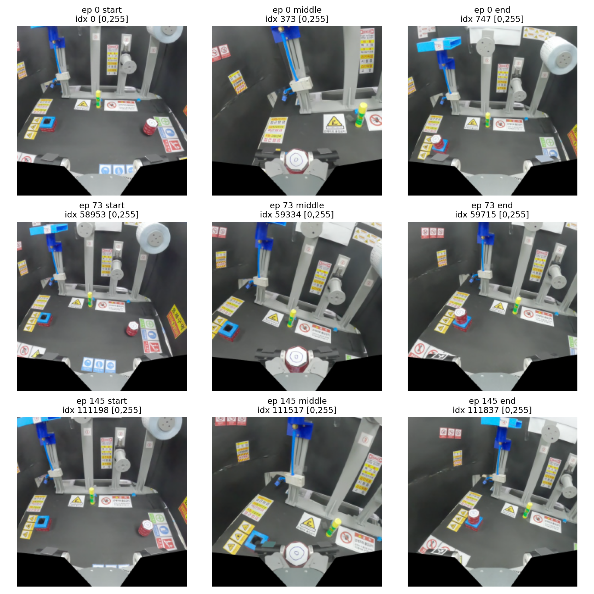
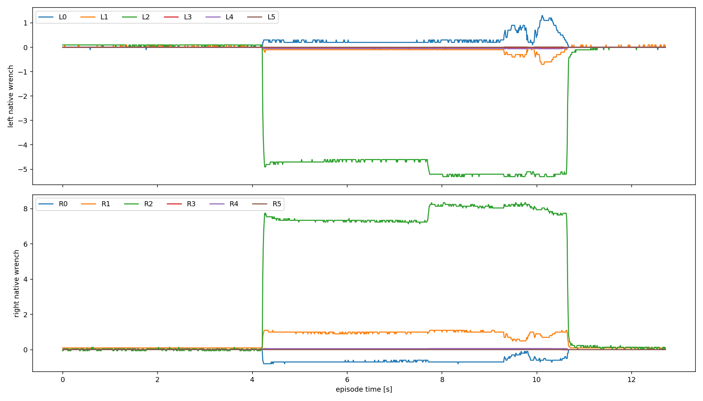
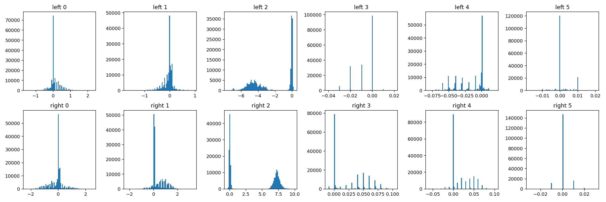

# 0814 dual-F/T multirate dataset report

## 결론

검사 대상은 `data/dataset_multirate_clean.zarr.zip`이며 원본 ZIP을 수정하거나
추출하지 않았다. 현재 Zarr 2.x는 nested group open을 지원하므로 extraction
cache도 생성하지 않았다.

- detected prefix: `dataset_multirate_clean.zarr`
- open: `zarr.ZipStore(mode="r")` 후
  `zarr.open_group(store=store, path="dataset_multirate_clean.zarr", mode="r")`
- episode: 146
- RGB/pose/gripper policy-anchor rows: 111,838
- left/right raw F/T rows: 각 186,338
- ZIP SHA-256 전/후:
  `3f5e0aecc3184deb313d5c11cb2eabb4dd9e1d7a43287a449f24d500d36cfaa5`
- SHA-256 unchanged: yes

기계 판독 가능한 전체 결과는
[`inspection.json`](dataset_multirate_clean_audit/inspection.json), episode별 결과는
[`dropped_anchors.csv`](dataset_multirate_clean_audit/dropped_anchors.csv)에 있다.

## Nested Zarr와 JPEG-XL

ZIP 내부의 single top-level prefix를 자동 탐지한다. ambiguity가 있으면 추측하지
않고 오류로 중단한다. `UmiDualFTDataset`은 low-dimensional 배열만 process-local
NumPy로 읽고 RGB ZipStore는 worker PID별 최초 접근 때 lazy-open한다. fork 전에
부모 process에서 열려 있던 handle도 PID가 다르면 worker에서 닫고 다시 연다.

JPEG-XL metadata에는 TARGET의 기존 local codec constructor가 받지 못하던 아래
field가 있다.

| field | 실제 값 | compatibility 처리 |
|---|---|---|
| `bitspersample` | `None` | 허용하고 warning log |
| `squeeze` | `None` | 허용하고 warning log |

두 field는 값이 `None`일 때만 무손실 compatibility로 받는다. non-`None` 값은
조용히 제거하지 않고 `ValueError`로 중단한다. dataset metadata 및 JPEG-XL
payload는 변경하거나 재인코딩하지 않는다.

## RGB decode 검증

Episode 0, 73, 145의 시작/중간/끝, 총 9개 frame을 실제 JPEG-XL decode했다.
모든 frame이 Zarr metadata와 동일한 `(224,224,3)`, `uint8`, HWC RGB였고,
pixel range는 모두 `[0,255]`였다. montage를 육안 검사했으며 색 channel swap,
decode corruption, 빈 frame은 없었다.



| episode | position | global index | shape | dtype | range | mean |
|---:|---|---:|---|---|---|---:|
| 0 | start | 0 | `[224,224,3]` | uint8 | 0–255 | 99.1523 |
| 0 | middle | 373 | `[224,224,3]` | uint8 | 0–255 | 93.8141 |
| 0 | end | 747 | `[224,224,3]` | uint8 | 0–255 | 103.1871 |
| 73 | start | 58,953 | `[224,224,3]` | uint8 | 0–255 | 98.7611 |
| 73 | middle | 59,334 | `[224,224,3]` | uint8 | 0–255 | 97.6492 |
| 73 | end | 59,715 | `[224,224,3]` | uint8 | 0–255 | 95.7765 |
| 145 | start | 111,198 | `[224,224,3]` | uint8 | 0–255 | 95.5522 |
| 145 | middle | 111,517 | `[224,224,3]` | uint8 | 0–255 | 93.3285 |
| 145 | end | 111,837 | `[224,224,3]` | uint8 | 0–255 | 94.6286 |

## 실제 timeline과 policy anchor

Episode 경계 사이의 timestamp jump는 제외하고 각 episode 내부 `dt`로 계산했다.

| modality | median dt | actual frequency | duplicate/non-monotonic |
|---|---:|---:|---:|
| RGB/pose/gripper | 16.683340 ms | 59.940035727 Hz | 0 / 0 |
| left/right F/T | 9.999990 ms | 100.000095368 Hz | 0 / 0 |
| policy/action (`down_sample_steps=3`) | 50.050020 ms | 19.980011909 Hz | 해당 없음 |

실제 policy anchor는 TARGET sampler의 `current` row에서 사용하는 최신
`rgb_0` timestamp다. `robot_time_stamps_0`과 `gripper_time_stamps_0`은 이 RGB
timestamp 배열과 bitwise equal이다. First RGB frame을 index만 보고 삭제하지
않는다.

각 episode/각 sensor에 대해 다음을 독립 검사한다.

```python
index = np.searchsorted(sensor_timestamp, anchor_timestamp, side="right") - 1
valid = index >= 0
```

left/right 중 하나라도 `valid`가 아니면 해당 training anchor를 제외한다.
anchor에 causal F/T가 하나 이상 생긴 이후, 과거 32-slot history 앞부분만 그
episode의 earliest causal F/T로 `repeat_first` padding한다. 미래의 첫 F/T는
padding에 쓰지 않는다.

- 전체 causal drop: 146 / 111,838 = 0.1305459683%
- 각 episode: 정확히 1개 drop
- 원인: 모든 episode에서 첫 RGB anchor가 첫 left/right F/T timestamp보다 앞섬
- episode별 drop ratio: 약 0.1075%–0.1684% (episode 길이에 따라 다름)
- 전체 146개 row: [`dropped_anchors.csv`](dataset_multirate_clean_audit/dropped_anchors.csv)
- valid anchor의 latest F/T age: mean 5.004 ms, median 5.007 ms,
  p95 9.504 ms, max 11.182 ms
- 선택된 F/T가 anchor보다 미래인 경우: 0

## F/T convention

이번 정책은 F/T-conditioned position Diffusion Policy이며 물리적인 force
controller가 아니다. raw six-axis wrench를 force command나 target으로 쓰지
않는다.

| 항목 | left | right |
|---|---|---|
| dataset key | `wrench_left_0` | `wrench_right_0` |
| frame | left native sensor frame | right native sensor frame |
| order | `Fx,Fy,Fz,Tx,Ty,Tz` | `Fx,Fy,Fz,Tx,Ty,Tz` |
| force unit | N | N |
| torque unit | Nm | Nm |
| software permutation | `[0,1,2,3,4,5]` | `[0,1,2,3,4,5]` |
| software sign | `[+1,+1,+1,+1,+1,+1]` | `[+1,+1,+1,+1,+1,+1]` |
| bias | raw, not subtracted | raw, not subtracted |

Dataset attrs도 `wrench_is_raw=true`, `wrench_bias_subtracted=false` 및 12-channel
left-then-right order를 명시한다. `policy_force_frame=tcp` attrs는 별도의 derived
3D label key에 관한 것이며 이 pipeline에서 사용하지 않는다.

Recorder와 deployment는 둘 다 `FT_REGISTER_INDICES =
[2,3,4,5,6,7,11,12,13,14,15,16]` 및 동일 `FT_FORCE_MASK`를 쓴다. signed register
중 force는 `/10`, torque는 `/100`으로 변환한다. Deployment controller가 같은
`parse_ft_status()`를 호출하므로 저장/추론 software convention은 동일하며
추가 axis permutation, sign flip, 합/평균, wrist/tool transform은 없다.

센서 native 축의 물리적인 방향과 robot mounting 방향을 world/tool 축으로
해석하는 도면은 저장소에서 확인하지 못했다. 이 정책은 양쪽 모두 동일한 native
값을 학습·추론하므로 임의 transform을 만들지 않는다. 다만 sensor를 재장착할
경우 mounting orientation 일치 확인은 deployment blocker다.

## Train-split 12-channel normalization statistics

Split은 seed 42, validation ratio 0.05이다. Validation episode는
`[12,62,92,109,124,143,145]`, train은 139 episode/177,845 F/T rows다. 아래
통계는 train episode만 사용했으며 float32 `LinearNormalizer`에 저장되는 값과
일치한다. Left/right는 별도 6-channel min/max normalizer이며 각각 `[-1,1]`로
mapping한다.

Channel 순서는 각 row마다 `Fx,Fy,Fz,Tx,Ty,Tz`다.

| side/stat | Fx | Fy | Fz | Tx | Ty | Tz |
|---|---:|---:|---:|---:|---:|---:|
| left min | -1.532000 | -1.700000 | -7.596000 | -0.040000 | -0.080000 | -0.017200 |
| left max | 2.276000 | 0.924000 | 0.200000 | 0.020000 | 0.020000 | 0.020000 |
| left mean | 0.093460 | -0.059888 | -2.284495 | -0.006696 | -0.017394 | 0.001173 |
| left std | 0.319390 | 0.215737 | 2.353350 | 0.009128 | 0.021075 | 0.004317 |
| right min | -2.320000 | -2.212000 | -0.284000 | -0.010000 | -0.059600 | -0.030000 |
| right max | 2.500000 | 3.300000 | 9.836000 | 0.102800 | 0.100800 | 0.030000 |
| right mean | -0.096906 | 0.351382 | 3.658831 | 0.025471 | 0.016936 | 0.000459 |
| right std | 0.511539 | 0.529197 | 3.636723 | 0.028578 | 0.024552 | 0.004570 |





## Allowlist와 최종 tensor contract

Dataset에 존재하는 key를 자동 등록하지 않는다. 사용 key는 단일 GoPro RGB,
기존 pose/gripper coordinate, raw left/right 6D F/T뿐이다. Action은 기존
TARGET convention인 relative position 3 + rotation-6D 6 + `gripper_0` 1 = 10D다.

`stiffness_0`, virtual target, grasp-force target, ACP action21, derived wrist/TCP
force, depth, second camera 및 기타 postprocessed label은 shape_meta,
observation, action, normalizer 모두에서 제외했다.

| tensor | per-sample shape |
|---|---:|
| `camera0_rgb` | `[2,3,224,224]` |
| `robot0_eef_pos` | `[2,3]` |
| `robot0_eef_rot_axis_angle` | `[2,6]` |
| `robot0_gripper_width` | `[2,1]` |
| `robot0_eef_rot_axis_angle_wrt_start` | `[2,6]` |
| `robot0_ft_left` | `[32,6]` |
| `robot0_ft_right` | `[32,6]` |
| fused model condition | `[800]` |
| action | `[16,10]` |

F/T history span은 `(32-1)/100.000095368 = 약 310 ms`다. Prediction horizon은
기존 16을 유지한다. 실제 action frequency 19.980011909 Hz에서 default
`n_action_steps=2`, replanning interval은 100.100 ms다. Config override만으로
1/2/4/8 step ablation이 가능하다.

## 남은 deployment 확인

전체 robot deployment/training은 이 작업에서 의도적으로 실행하지 않았다.
Software register/order/unit convention은 recorder와 inference가 동일함을
확인했다. 실제 로봇 투입 전에는 다음만 별도로 확인해야 한다.

- 학습 때와 동일한 left/right sensor가 동일 mounting orientation으로 설치됨
- live debug의 left/right latest timestamp가 RGB anchor 이하이고 age가 합리적임
- pretrained CLIP weight와 학습 checkpoint가 robot PC에 준비됨
- plan-only에서 observation/action tensor 및 안전 제한을 확인함

