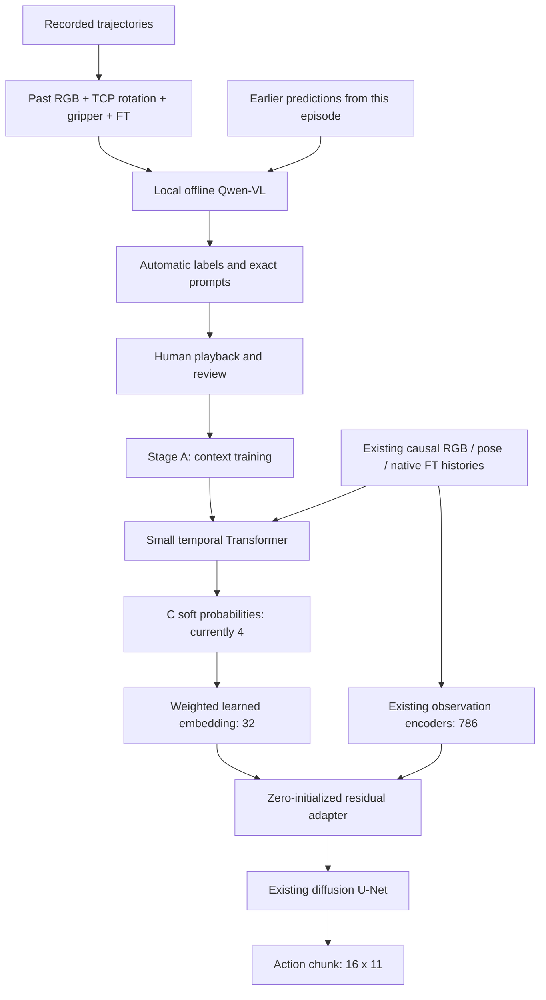

# Context-aware imitation learning

## Original pipeline (inspected before implementation)

The active UMI-FT baseline is `train_diffusion_unet_timm_umi_dual_ft_workspace`
with task `umi_dual_ft_260827_bias_only`. The existing four-state valve v2
observer is a separate experiment with its own class meanings and checkpoints.

Local data inspection found 214 episodes, 120,616 RGB/state rows and 200,865
native wrench rows in `session_260827/dataset.zarr.zip` and its force sidecar.
Episode ends are cumulative, exclusive. RGB is stored uint8 NHWC 224x224x3;
position is XYZ, raw rotation axis-angle (3), and gripper width (1). There are
no measured joints or object poses in this dataset. The base ZIP has no
independent sensor clocks: the audited sidecar supplies corrected RGB timestamps,
wrench timestamps, episode boundaries and causal RGB-to-wrench mappings.

`UmiDualFTDataset` validates alignment, takes RGB/pose at [t-3,t] on the
59.9400357 Hz RGB grid, transforms poses relative to the last observed TCP,
and takes 32 native 100.000095 Hz F/T rows ending no later than t. Early
histories repeat the first available episode sample. Action targets start at t,
use stride 3, and span 16 rows at 19.9800119 Hz. Incomplete action chunks are
excluded unless action padding is explicitly enabled. The 11 action channels
are relative XYZ (3), relative rotation-6D (6), absolute gripper width (1), and
signed grasp-force reference (1). The force reference controls a bounded width
correction in deployment, not the hardware force register directly.

| Tensor | Shape |
| --- | --- |
| camera0_rgb | B,2,3,224,224 |
| robot0_eef_pos | B,2,3 |
| robot0_eef_rot_axis_angle | B,2,6 |
| robot0_ft_left / robot0_ft_right | each B,32,6 |
| encoded observation | B,786 |
| target / predicted action | B,16,11 |

`DualFTObsEncoder` uses CLIP ViT-B/16 image features (768), separate
[16,32,64,128] temporal F/T CNNs, one 768-wide/8-head fusion Transformer,
and an output projection to 768. Flattened two-step pose contributes 18,
for 786 total. `DiffusionUnetTimmPolicy` passes this to the unchanged
`ConditionalUnet1D` (down widths 256/512/1024, diffusion time embedding 32).
DDIM uses 50 training timesteps and 16 inference steps; training predicts noise
with the existing perturbed-input MSE. The execution horizon defaults to two
steps and is independent of prediction horizon.

Hydra `train.py` runs `TrainDiffusionUnetImageWorkspace`, with Accelerate,
EMA, dataset normalizers, episode validation split, and workspace checkpoints.
Warm starts copy matching shared weights and rebuild normalizers. Live inference
is `eval_real_indy_rg2.py`, also launched through its dual-FT wrapper; it uses
existing camera/state/native-FT history buffers and resets the policy per episode.
The offline evaluator is `eval_dual_ft_offline.py`; the configured real-environment
runner does not provide autonomous task-success measurement.

## Configurable context implementation



The LLM is used only by `scripts/generate_context_labels.py`. It is never
imported or called by the online classifier, policy, dataset, or robot runtime.
The existing four-state valve experiments remain separate and unchanged.

Define mutually exclusive classes in `context/qwen/config/context_labels.yaml`. The current
four classes are **0: approach, 1: turning, 2: finish, 3: error**; unknown is -1.
IDs must be consecutive from zero and there must be at least two classes.
Labeling, review controls, training heads, embeddings, and reports derive their
class count from this file. Stage A reads `context_definitions`; Stage B reads
`context_training.definitions_path`, both defaulting to this file. Checkpoints
save their resolved class count so inference does not depend on the YAML.
Names and descriptions are data, not source constants. The CLI
rejects placeholder descriptions unless `--allow-placeholder-classes` is supplied
for a mechanics test. Choose observable distinctions, describe boundaries and
ambiguous cases, then review representative episodes before labeling everything.
Changing meanings should use a new `label_version` and output directory. Names
and descriptions have a SHA-256 digest checked against existing annotations.
After changing the class definitions, regenerate labels and train a new context
encoder and context adapter. Old five-class checkpoints retain their original
shape; loading one into the current four-class policy raises a clear mismatch.

### Offline labeling and reproducibility

Qwen3.5-9B is available as a separate comparison backend and config:
`context/qwen/config/context_labels_qwen35.yaml`. See
[`context/qwen/README.md`](../context/qwen/README.md) for setup, GPU 3 inference,
and video export commands. The original UMI interpreter loads data and a
separate Python 3.11 worker runs modern Transformers. This preserves the older
training dependencies. V8 results use `data/context_labels_v8_qwen35`; training
defaults are not automatically switched to unreviewed predictions.
V8 computes contact and rapid force decreases from native samples and uses Qwen
only for constrained visual observations. Numeric reasons are generated from
measured force. The v7 model-only comparison config is archived separately.

The v2 model is `Qwen/Qwen2.5-VL-3B-Instruct`, configured at the local directory
`context/qwen/checkpoints/Qwen2.5-VL-3B-Instruct`. It uses a separate
`context/qwen/.venv` environment (Transformers 4.51.3), preserving the original
UMI environment and its older Diffusers dependencies. All paths in the context
configuration are relative to the repository root. Offline loading uses
`local_files_only=True`, disables Hub networking, and disallows remote code.
Decoding is greedy (`do_sample=False`, one beam), the deterministic equivalent of
temperature zero. Seed and generation settings are recorded. No paid service or
API key is used. Numerical kernels can still differ across devices/versions.

For this machine, restrict CUDA visibility to physical GPUs **2 and 3**.
With `CUDA_VISIBLE_DEVICES=2,3`, `--devices cuda:0 cuda:1` loads one Qwen copy
on each selected GPU. Different episodes run concurrently; windows within an
episode run sequentially so each prediction can inform the next. One writer
stores results in chronological order per episode (episodes may be interleaved).
The window
limit applies to the whole run, and resume skips completed rows when switching
between one and two GPUs. Resume rebuilds previous-prediction context from
completed rows; holes in an episode's cached prefix are rejected. A single-GPU run can still use `--device cuda:0` or
`--device cuda:1` within that same visibility mask.

The labeler summarizes an episode-local causal RGB window `[t-H+1,t]`, default
H=121 RGB rows (~2 seconds). It supplies up to eight native RGB frames ending
at the anchor, current TCP rotation and relative rotation history/angular velocity,
gripper-width and force-magnitude statistics. TCP position statistics are excluded. Only
native F/T samples whose timestamps fall inside that past window are included.
The right-finger force history additionally preserves first/last samples and
force-norm minima/maxima within 12 consecutive sample bins, retaining brief
spikes and their original time offsets. Each row contains only `offset_s` and
`force_norm_N = sqrt(Fx^2 + Fy^2 + Fz^2)` in newtons. Both fingers' statistics
also describe only this magnitude; signed force components and all torque values
are excluded from Qwen's JSON. Magnitude changes retain their sign to distinguish
increases from decreases. Raw sensor data and policy F/T inputs are unchanged.
Missing samples are explicitly unavailable, not zero force;
the age of the last native sample is included. No numerical contact or sharp-drop
threshold is imposed without calibration.
The latest eight earlier automatic predictions from this episode and their
confidence are supplied as fallible context. Progress means elapsed time and
time since the last predicted class change, never true completion percentage.
No measured valve angle, target pose or completion signal is available; these
are never fabricated. Each prompt records the source RGB indices/time offsets.
The scene is explicitly described as pushing the orange lever with the right
finger. The camera is attached to the gripper and rotates with the finger/lever.
Consequently, an image-stationary lever may be turning in the world: coherent
rotation of the fixed rig/signs/background relative to the finger/lever, together
with right-finger force and maintained interaction, is turning evidence.
Approach/recede translation or scale change and independent camera repositioning
are not by themselves evidence of lever turning. TCP rotation corroborates camera
rotation but does not replace visual interaction and force evidence.
The v6 task definitions are:

- Approach: the finger visibly moves closer to the lever.
- Turning: right-finger force coincides with turning inferred from the moving-camera
  geometry; the lever need not move in image coordinates.
- Error: rotation without observed finger force, or a previously visible lever
  disappearing from view. Disappearance remains an error during retreat.
- Finish: right-finger force magnitude drops sharply relative to its recent
  observed level. Assign finish at the observed drop; a preceding force rise,
  rotation stop or retreat is not required. Steady low force, small fluctuations
  and missing samples alone do not establish finish. Compare recent samples
  near the current anchor; do not backfill earlier anchors using a future drop.

Missing/ambiguous evidence is unknown; absence of force alone is not approach.
Previous predictions are not evidence that a force drop occurred. A
change not established by the available causal history may remain unknown;
the two-second window is a starting setting, not a validated task duration.
Recorded future pose/force action targets are not past executed actions and are
never supplied to the labeler or online context encoder.

The default `label_stride=6` labels approximately 10 **native RGB anchors**
per second. A stride of 2 would label ~30 windows/second in this recording,
and stride 3 ~20 Hz; stride units are RGB rows, not control updates. Automatic labels are held forward to the next automatic
anchor, within the same episode, with unknown before the first anchor. There is
no interpolation across class IDs and no backward filling. `--end-index` is
exclusive; indices and window bounds are episode-local, and window end is inclusive.
Review decisions are frame-specific: reviewing one anchor does not implicitly
review its neighbors. Segment edits explicitly save every frame in the segment.

V6 outputs use `data/context_labels_v6/`, separate from earlier vision results in
`data/context_labels_v2/` through `data/context_labels_v5/` and text-only results in
`data/context_labels/`. Archived configs `context/qwen/config/context_labels_v1.yaml`
through `context_labels_v5.yaml` preserve the respective
definitions/output paths for reviewing those old results.
V6 retains magnitude-only force inputs and changes finish to a sharp force drop:
start a new v6 run rather than resuming v5. Stage A/B defaults now point to v6
labels and the v6 episode split manifest.
Outputs are separate from raw data:

- `auto_labels.jsonl`: durable append-only completed windows; flushed/fsynced
  after each response. `--resume` skips cached `(episode_id, anchor_index)` pairs.
- `auto_labels.parquet`: derived table regenerated from JSONL on completion.
- `labeling_manifest.json`: definitions, version/digest, model byte-content hash,
  seed, decoding, stride/history, input selection, prompt-template hash, and dataset clock/file-identity fingerprint.
- `labeling_statistics.json`: counts/distribution, unknowns, mean confidence,
  and invalid-response attempt count.

Each automatic row includes episode/index/timestamp, class/confidence/reason,
model/version, window bounds, definition digest, provenance, exact prompt, all
attempt prompts/responses, and parsing-failure count. JSON parsing accepts a
plain object or a complete fenced object, validates class/confidence/reason
strictly, retries a limited number of times, and stores -1 on final parse failure.
The model may also return -1 directly when evidence is insufficient; that is a
valid unknown decision, not a parsing failure. The prompt contains no fixed
class/confidence example to copy. Self-reported confidence is not measured accuracy.
Model-loading/generation failures surface as errors; completed rows remain resumable.
Resume refuses changed model bytes, definitions, timing/source identity, or
labeling settings, including `--start-index`. Dataset identity includes clock arrays and file metadata;
it is not a full byte checksum of every RGB chunk. Keep immutable source data.
A corrupted/truncated JSONL line is reported rather than silently discarded.

### Playback and review

`tools/review_context_labels.py` uses the same reader and native timestamps as
training. It shows the available camera, TCP/rotation/gripper/force target,
native F/T components/norms, and automatic/reviewed/confidence timelines.
The present audited loader accepts one camera only; the camera selector reflects
that rather than inventing a second camera. There are no separate command/joint/
object streams; recorded TCP/width/force trajectories are the action targets.

Playback advances using recorded timestamps and selected speed; the UI refreshes
at 10 Hz while playing and may skip displayed frames at normal speed. Single-frame stepping,
seeking, segment start/end, transition jumps, low-confidence jumps, and plot-point
selection remain exact. Sensor plots show a configurable local time window.
Manual changes are red diamonds, approvals green diamonds, and automatic labels
are a separate line. The full-episode approval button preserves existing corrections.

Shortcuts: Space play/pause, Left/Right frame, 1–4 class 0–3, U unknown, S save.
Class buttons and shortcuts follow the configured class count (numeric keys 1–9).
Text-entry elements retain normal keyboard behavior. Save writes only
`reviewed_labels.parquet` and `review_progress.json`; automatic labels are
untouched. Review rows contain automatic/reference IDs and confidence,
reviewed class, modification/review flags, UTC review timestamp, definition digest,
and provenance (`reviewed`, `modified`, or `unknown`). Auto rows remain `auto` or
`unknown`. Progress includes episode/cursor and fully reviewed episodes. Unsaved
edits remain in session memory; press S before closing. Concurrent file changes
are detected and refused to prevent stale sessions overwriting another review.

The statistics panel includes automatic/reviewed distributions, confidence
histogram, correction rate/by-class, episode coverage, percentage reviewed,
transition counts, and segment durations. Low confidence, short segments,
neighbor disagreement, and rapid oscillation are flagged without deleting data.

### Context model and tensor contracts

The current Stage A and Stage B context configs explicitly select
`camera0_rgb`, `robot0_ft_left`, and `robot0_ft_right` via `encoder.input_keys`.
TCP position and orientation are excluded from context normalization, token
construction, and classification; the action policy retains its own observation
contract. The selection is saved in the context checkpoint and checked on load.
Omitting `input_keys` preserves the legacy all-observation encoder contract.

The canonical four-state classifier is implemented separately in
`models/rgb_force_context_encoder.py`, with its training entrypoint
`train_context_rgb_force.py`. See [the RGB/F/T training guide](context_rgb_force_training.md)
for the two-GPU command. It uses pretrained CLIP image features, causal F/T CNNs,
and the small temporal Transformer with no TCP inputs. Each finger's CNN receives
18 channels: raw six-axis wrench, a five-sample causal mean, and the mean's
five-sample-lag difference. The model computes 32 feature steps from 41 raw
samples; training statistics use the identical transform on training episodes.
It reads the canonical
284-episode NPZ directly and uses `approach/turning/recovery/error`, including
the validity mask and provenance weights. This checkpoint has its own schema;
the older pooled-RGB Stage B checkpoint loader does not load it directly.
The implementation described below is the older pooled-RGB baseline.

`models/context_encoder.py` projects each existing modality's raw observation
history to 128 dimensions, adds learned modality/time positions, and applies
2 Transformer layers with 4 heads, feedforward width 256, and dropout 0.1.
RGB is deterministically pooled to a 4x4 grid (48 values/frame); pose and F/T
retain their channels. Per-channel mean/std buffers are fitted **only to Stage A
training episodes** and saved with the encoder, so Stage B and deployment use
identical preprocessing independent of policy normalizers/image augmentation.

The histories retain their native sample rates. The selected RGB/F/T histories
are two RGB frames, 32 left F/T and 32 right F/T samples: 66 observation tokens
plus a terminal query. Legacy all-observation configs additionally include two
position and two rotation samples, for 70 observation tokens plus the query. Each modality
is ordered oldest-to-newest; modalities are concatenated in stable key order.
The attention mask is triangular in that token order; the final query sees all
of the causal histories. No future-to-anchor token exists. This avoids inventing
synchronized 100 Hz images or upsampling pose with future interpolation.
`history_length` crops each supplied history independently (default 32, maximum
the largest supplied buffer); increasing the native observation buffer requires
an explicit compatible task/encoder/deployment contract change. It does not
silently extend the original robot buffers.

| New tensor | Shape |
| --- | --- |
| Context token sequence, RGB/F/T selection | B,67,128 |
| Context logits / probabilities | B,C (currently C=4) |
| Learnable embedding table | C,32 |
| `probabilities @ embedding_table` | B,32 |
| Residual delta / fused conditioning | B,786 |
| Existing U-Net action output | B,16,11 |

Soft conditioning is the default. The fusion MLP reads `[robot_feature, context]`
and predicts a 786-D residual multiplied by a learned sigmoid gate. Its last
linear layer starts at zero, making initial fusion exactly identity. The existing
observation encoder, action model and diffusion noise-target MSE are preserved.
Only two overridable hooks were added to the base policy; old policy targets and
state-dict names retain compatibility.

### Training, splits, and ablations

Stage A uses reviewed known labels by default, ignores -1, fits train-only
normalization, supports inverse-frequency CE weights, and chooses the best
checkpoint by validation macro F1 (all configured classes). It reports accuracy,
balanced accuracy (classes present in the split), macro/per-class precision,
recall/F1, confusion matrix, original distributions, ECE bins, Brier score,
negative log likelihood, and confidence. The test split is used only after model
selection. All three splits are by episode and saved to `episode_splits.json`;
Stage B reuses and verifies the same split/source manifest. Test windows never
enter Stage B's train or validation datasets or normalizer.

The `labels.source` / `task.dataset.context_labels.source` choices are `reviewed`,
`high_confidence_auto`, and `all_auto`. Explicit human decisions take precedence
in every mode. `mix_auto=true` fills unreviewed frames with high-confidence weak
labels; defaults are threshold 0.9, reviewed weight 1.0, auto weight 0.3. An
explicit human unknown blocks automatic fallback. Automatic labels never acquire
`is_reviewed=true` in a training loader.

Stage B runs the **existing** `train.py` Hydra/Accelerate/EMA workspace:
`L_total = original diffusion MSE + lambda_context * weighted CE` (default 0.1).
The policy always conditions on its own predicted probabilities unless an ablation
is explicitly selected. No teacher one-hot conditioning is used by default.
The Stage A checkpoint initializes only during training startup, not deployment.
Its definitions/digest and split metadata are copied into the policy checkpoint;
all context weights/statistics are self-contained in that checkpoint.

The curriculum is explicit across runs: Stage A classifier; Stage B
`curriculum=adapter` freezes the existing action/observation modules and trains
fusion/embedding; then optional `curriculum=full` trains all policy modules at
lower per-module learning rates. `freeze_encoder=true/false` controls context
freezing separately. Frozen modules stay in eval mode. Adapter training requires
an existing policy warm-start checkpoint; it refuses to freeze a randomly
initialized action model. Full fine-tuning starts a fresh optimizer through the
existing warm-start mechanism; resume retains the current architecture/curriculum.

| Experiment | Hydra overrides |
| --- | --- |
| A, original pipeline | Original `train_diffusion_unet_timm_umi_dual_ft_workspace` |
| A, same split without context | `policy.context.mode=none context_training.encoder_checkpoint=null` |
| B, oracle | `policy.context.mode=oracle task.dataset.require_known_context=true` |
| C, predicted hard | `policy.context.mode=hard` |
| D, proposed soft | `policy.context.mode=soft` (default) |
| E, frozen context | `policy.context.freeze_encoder=true` (default) |
| F, joint context | `policy.context.freeze_encoder=false` |

Oracle requires a known label for every sample and is refused in real-robot
inference. Hard conditioning uses argmax/one-hot only for the ablation; classifier
learning then comes from auxiliary CE. Smoothing is disabled during training;
deployment optionally applies `alpha*p + (1-alpha)*previous` with explicit reset
at every episode. Raw, smoothed, and actually used probabilities are all retained.
Batched offline action evaluation requires smoothing disabled, as unrelated
windows must never share temporal state. The context evaluation entrypoint
explicitly disables it and reports unsmoothed predictions.

A legacy action checkpoint may have been trained on episodes now assigned to the
new test set. Episode splitting alone cannot undo that pretraining exposure.
For a defensible held-out policy comparison, warm-start every ablation from a
baseline trained only on the shared training episodes, or use entirely new test
recordings. Keep the baseline's training provenance with the experiment.

### Real inference and evaluation

The existing robot evaluator already provides causal buffers and resets policy
state per episode. `ContextAwarePolicy` consumes those same raw observations,
computes probabilities for the saved classes and optional EMA smoothing, and fuses the
embedding before diffusion inference. No extra camera process, history source,
LLM, label file, or standalone Stage A checkpoint is required in deployment.
The existing robot/F-T calibration, age, action and safety contracts still apply.

`eval_real_indy_rg2.py` writes `context_probabilities.jsonl` alongside existing
F/T/state/actions/video diagnostics, one row per control update with the shared
anchor timestamp and cycle. `policy.context.log_every` controls console frequency;
all probability rows are persisted. `reset()` clears smoothing at episode starts.

`eval_context_aware.py` accepts either a Stage A `.pt` or Stage B workspace
checkpoint. Stage B reuses `eval_dual_ft_offline.evaluate_loader`: position,
rotation/geodesic, width, force, normalized action error, pure diffusion action
loss, and latency remain available, with per-context action MSE added. Default
split is test. Task success/completion/rollout success are null because offline
trajectories and the existing empty real-environment runner cannot establish
physical outcomes. Measure those through actual reviewed robot trials.

`outputs/context_eval/` is created by evaluation. It contains:
`confusion_matrix.png`, `context_timeline.png`, `confidence_histogram.png`,
`class_distribution.png`, `transition_statistics.csv`, `metrics.json`, and
`predictions.npz`; policy evaluation additionally saves `policy_metrics.json`.
Timeline PNG shows up to six episodes for readability; the NPZ retains all
predictions. Transition CSV includes episode-local predicted segments, durations
and sample counts. Sparse reviewed labels yield sparse timelines and approximate
segment durations; use fully reviewed episodes for temporal stability evaluation.

## Exact commands

From the repository root, activate the existing UMI environment, then install
only the optional context dependencies. The Hub pin preserves compatibility with
this repository's existing Diffusers (which still imports `cached_download`).
The offline loader behavior follows the [Transformers 4.45 documentation](https://huggingface.co/docs/transformers/v4.45.2/installation#offline-mode);
timeline seeking uses [Streamlit Plotly selection events](https://docs.streamlit.io/develop/api-reference/charts/st.plotly_chart).

```bash
cd /home/metafarmers/dkim/umi_ft
conda activate umi
python -m pip install -r requirements_context.txt

# Separate vision-labeling environment; do not activate it for policy training.
python -m venv --system-site-packages context/qwen/.venv
context/qwen/.venv/bin/python -m pip install -r context/qwen/requirements-vl.txt
context/qwen/.venv/bin/huggingface-cli download Qwen/Qwen2.5-VL-3B-Instruct \
  --local-dir context/qwen/checkpoints/Qwen2.5-VL-3B-Instruct

# Only physical GPUs 2 and 3 may be used in this shell.
export CUDA_DEVICE_ORDER=PCI_BUS_ID
export CUDA_VISIBLE_DEVICES=2,3

# Edit context names/descriptions in context/qwen/config/context_labels.yaml first.
context/qwen/.venv/bin/python scripts/generate_context_labels.py \
  --config context/qwen/config/context_labels.yaml \
  --devices cuda:0 cuda:1 \
  --label-stride 6 --max-windows 100

# Resume the same settings; use --episode N and local --start-index/--end-index
# to bound work, or --max-windows 100 for an initial review sample.
context/qwen/.venv/bin/python scripts/generate_context_labels.py \
  --config context/qwen/config/context_labels.yaml \
  --devices cuda:0 cuda:1 \
  --label-stride 6 --resume

streamlit run tools/review_context_labels.py

# To inspect the archived v1 labels with their matching definitions:
CONTEXT_REVIEW_CONFIG=context/qwen/config/context_labels_v1.yaml \
  streamlit run tools/review_context_labels.py

# Requires reviewed samples in all three episode splits.
python train_context_encoder.py --config context/qwen/config/train_context.yaml \
  --set device=cuda:0

# Stage B: existing Hydra entrypoint; preserve the pretrained baseline weights.
python train.py --config-name=train_context_aware_policy \
  training.init_from_checkpoint=/path/to/existing_dual_ft.ckpt \
  context_training.encoder_checkpoint=checkpoints/context_encoder_best.pt \
  hydra.run.dir=data/outputs/context_adapter

# Optional Stage C: full-policy fine-tuning with configured lower base LRs.
python train.py --config-name=train_context_aware_policy \
  training.init_from_checkpoint=data/outputs/context_adapter/checkpoints/latest.ckpt \
  policy.context.curriculum=full \
  policy.context.freeze_encoder=false \
  hydra.run.dir=data/outputs/context_full

# Resume an interrupted adapter run (same model/curriculum/run directory).
python train.py --config-name=train_context_aware_policy \
  training.resume=true \
  hydra.run.dir=data/outputs/context_adapter

python eval_context_aware.py \
  --checkpoint checkpoints/context_encoder_best.pt \
  --split test --output-dir outputs/context_eval/encoder

python eval_context_aware.py \
  --checkpoint data/outputs/context_adapter/checkpoints/latest.ckpt \
  --split test --device cuda:0 --output-dir outputs/context_eval/policy

# Existing deployment wrapper; starts with its hardware dry-run mode.
python eval_real_indy_rg2_dual_ft.py \
  --checkpoint data/outputs/context_adapter/checkpoints/latest.ckpt \
  --robot-config example/eval_robots_config_indy_rg2.yaml \
  --log-dir data/eval_context/dry_run \
  --match-dataset session_260827/dataset.zarr.zip \
  --n-action-steps 1 --dry-run --max-cycles 1
```

Use `--dataset-override task.dataset_path=/path/to/base.zarr.zip` and
`--dataset-override task.force_sidecar_path=/path/to/sidecar.zarr` for labeling;
put the same overrides in both YAML `dataset_overrides` lists for review/Stage A,
and use the equivalent Hydra task overrides for Stage B. Stage A's split manifest
binds these sources. Config files live under root `config/` for the offline tools,
and `diffusion_policy/config/` for the existing Hydra policy training convention.
There is deliberately no second action-policy training entrypoint.

A synthetic mechanics smoke test (new empty output directory required):

```bash
python scripts/smoke_context_pipeline.py --output-dir /tmp/context-pipeline-smoke

PYTEST_DISABLE_PLUGIN_AUTOLOAD=1 OMP_NUM_THREADS=2 MKL_NUM_THREADS=2 \
python -m pytest -q \
  tests/test_context_dataset.py tests/test_context_encoder.py \
  tests/test_context_embedding.py tests/test_context_fusion.py \
  tests/test_causal_window.py tests/test_context_label_io.py \
  tests/test_context_policy.py tests/test_context_review.py \
  tests/test_dual_ft_policy.py tests/test_dual_ft_offline_eval.py \
  tests/test_dual_ft_inference.py tests/test_dual_ft_dataset_bias.py \
  tests/test_valve_context_contract.py tests/test_context_input_capture.py
```

`PYTEST_DISABLE_PLUGIN_AUTOLOAD=1` avoids unrelated ROS Python-version/plugin
imports in this host environment; these tests do not require those plugins.

## Verification and limitations

The smoke test creates a six-episode synthetic Zarr recording with actual UMI
modalities/timing/shapes, generates fixture automatic labels, verifies resume,
saves explicit fixture review decisions, trains the default context encoder,
then runs one batch through the real Hydra policy workspace with a smaller
ResNet/U-Net CPU configuration. It strictly restores the policy checkpoint,
executes a 16x11 action prediction, reuses existing offline action metrics,
reloads Stage A through the evaluation entrypoint, and exercises a tiny random
Qwen model through the genuine offline Transformers loader. The tiny random
model produces unknown on invalid JSON; it is not the pretrained 0.5B model.
Synthetic fixture labels are not presented as human-reviewed real-robot evidence.

Measured current four-class context encoder (CPU batch 1, 71 tokens, 50 iterations,
5 warmups, two PyTorch CPU threads, PyTorch 2.1.0):

| Measurement | Result |
| --- | --- |
| Parameters | 279,812 |
| CPU inference latency | 2.73 ms (local four-class smoke measurement) |
| GPU inference latency | Not measured; CUDA unavailable in this session |

Latency excludes dataset/image decode and action-policy inference. Run
`eval_context_aware.py` on the intended deployment host for its CPU/GPU report;
CUDA timing uses synchronization. These figures do not establish robot loop
latency or task success.

The real local recording was opened read-only and a batch verified against the
actual shapes/timestamps. A complete real-data labeling/training run has not been
performed. The four class meanings are configured; select a local pretrained
Qwen-VL directory before running offline labeling. Model confidence is not calibrated ground truth;
visual distinctions and subtle contact events may be missed. Human review and
held-out episode evaluation remain necessary. No robot actuation was performed.
Optional GRU/TCN and deployment dwell/hysteresis are not implemented; the provided
baseline is the small Transformer with optional probability EMA smoothing.

### Files created and modified

Created:

- `context/qwen/config/context_labels.yaml`, `context/qwen/config/train_context.yaml`,
  `diffusion_policy/config/train_context_aware_policy.yaml`, `requirements_context.txt`.
- `models/__init__.py`, `models/context_encoder.py`.
- `diffusion_policy/context/{__init__,data,labels,evaluation,runtime}.py` and
  `diffusion_policy/policy/context_aware_policy.py`.
- `scripts/__init__.py`, `scripts/generate_context_labels.py`,
  `scripts/smoke_context_pipeline.py`, `tools/review_context_labels.py`.
- `train_context_encoder.py`, `eval_context_aware.py`, this document.
- `tests/conftest.py`, `tests/test_context_dataset.py`,
  `tests/test_context_encoder.py`, `tests/test_context_embedding.py`,
  `tests/test_context_fusion.py`, `tests/test_causal_window.py`,
  `tests/test_context_label_io.py`, `tests/test_context_policy.py`,
  `tests/test_context_review.py`.

Modified:

- `diffusion_policy/policy/diffusion_unet_timm_policy.py`: conditioning/auxiliary
  hooks, optional oracle argument, context diagnostics in inference results.
- `diffusion_policy/workspace/train_diffusion_unet_image_workspace.py`: context
  optimizer groups, Stage A initialization/metadata/split checks, optimizer retention for context resume, oracle sampling.
- `eval_dual_ft_offline.py`: configured context targets, separate action loss,
  context diagnostics and per-context errors while retaining existing metrics.
- `eval_real_indy_rg2.py`: timestamped context probability logging.
- `train.py`: resolves the context class count from the definitions file before training.
- `README.md`: link to this pipeline and its command guide.

Validation performed in an isolated `/tmp/umi-context-env` (the original UMI
installation was not modified): **82 pytest checks passed**, including the
existing dual-F/T regression tests and four-/five-class compatibility tests.
The four-class smoke run passed at `/tmp/context-four-class-smoke-01`; it verifies
training, `[B,4]` probabilities, and a checkpoint with its resolved class count.
The earlier five-class smoke passed at `/tmp/context-smoke-06`.
During the original five-class verification, headless Chrome verified keyboard frame
stepping, class assignment/save, typing guards, and timestamp-driven playback;
Streamlit AppTest verified segment edits, persistence, resume, and preservation
of prior corrections. The supplied `outputs/context_eval/` figures and metrics
are clearly marked **synthetic smoke artifacts**, not real-data accuracy results.
`validation_report.json` records the checks and measured encoder cost.

Policy resume was additionally verified with Adam state restored and the standalone Stage A path intentionally absent. Context checkpoints retain optimizer state from the first run; original-policy checkpoint behavior is unchanged. Browser verification also covered clicking a context timeline point to seek the matching RGB frame.
